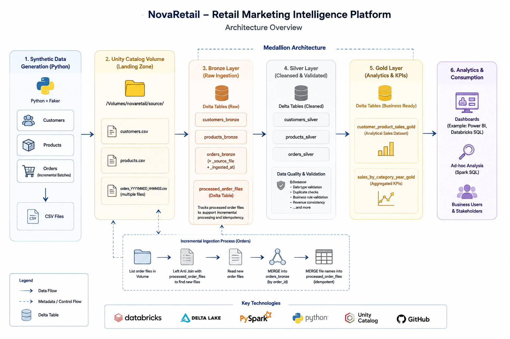

# NovaRetail - Databricks Retail Marketing Lakehouse

An end-to-end Data Engineering portfolio project built with Databricks Free Edition.

---

## Project Overview

This project demonstrates the implementation of a modern Medallion Lakehouse architecture (Bronze, Silver, Gold). It includes synthetic retail data generation, incremental data ingestion, data quality validation, Delta Lake, Unity Catalog, and Gold-layer analytical models.

The initial implementation intentionally avoids Databricks Auto Loader to demonstrate the underlying concepts of metadata-driven processing, incremental file ingestion, and idempotent pipeline design before introducing platform-specific automation.

For a detailed description of the project, architecture, and design decisions, see:

- [Project Overview](docs/project-overview.md)
- [Data Model](docs/data-model.md)

---

## Technology Stack

- Databricks Free Edition
- Delta Lake
- Unity Catalog
- PySpark
- Spark SQL
- Python
- GitHub
- Visual Studio Code

---

## Key Features

- Synthetic retail data generation
- Bronze / Silver / Gold Lakehouse architecture
- Incremental file ingestion
- Idempotent Delta Lake MERGE opKerations
- Data quality validation
- Unity Catalog Volumes
- Metadata-driven processing
- Analytical Gold tables

---

## Architecture

---

## Future Improvements

- Databricks Jobs / Workflows
- Auto Loader implementation
- Lakeflow Pipelines
- Automated unit tests